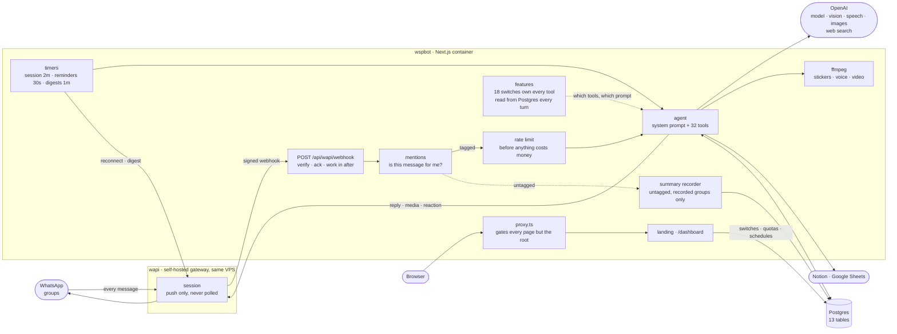
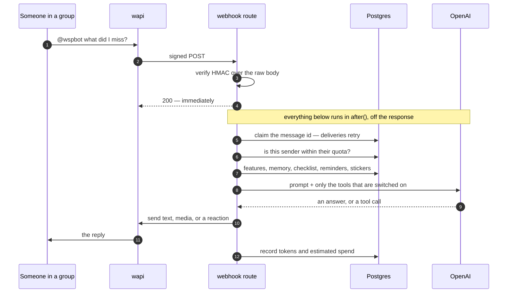

<div align="center">


# wspbot

**Tag it. It answers.**

A WhatsApp bot that earns its place in a group chat. It searches when being wrong would matter,
remembers what you tell it to, makes the sticker, keeps the list — and posts a digest of
everything you missed.

[**wspbot.crafter.run**](https://wspbot.crafter.run) · built by [Jibaru](https://jibaru.dev) of
[Crafter Station](https://crafter.run), in Lima

`Next.js 16` · `TypeScript` · `Postgres` · `OpenAI` · `ffmpeg` · self-hosted

**Open source, both halves.** ⭐ [`Jibaru/wspbot`](https://github.com/Jibaru/wspbot) — this bot ·
⭐ [`crafter-station/wapi`](https://github.com/crafter-station/wapi) — the WhatsApp gateway it runs on

</div>

---

```
you   → @wspbot record that we need to create a calendar schedule
bot   → Noted.
       …days later, after a redeploy…
you   → @wspbot what were we going to build?
bot   → A calendar schedule.
you   → @wspbot forget that
bot   → Done.
```

|  |  |
| --- | --- |
| **What it is** | One Next.js container: a webhook that answers WhatsApp, and a dashboard that decides what it may do |
| **Abilities** | 18 switchable features over 32 model tools, plus 3 that are always on |
| **Storage** | Postgres, 13 tables — memory, history, stickers, schedules, spend |
| **Runs on** | A Dokploy VPS behind Traefik, alongside the WhatsApp gateway it talks to |
| **Guarded by** | 14 check scripts that exercise the real thing rather than asserting about it |

## Contents

**Understand it** — [Architecture](#architecture) · [The life of one message](#the-life-of-one-message) · [Layout](#layout) · [Notes on the wapi integration](#notes-on-the-wapi-integration)

**Run it** — [Setup](#setup) · [Pointing wapi at it](#pointing-wapi-at-it) · [Staying connected](#staying-connected) · [Tuning](#tuning) · [Checks](#checks)

**Use it** — [The landing page](#the-landing-page) · [The dashboard](#the-dashboard) · [Signing in](#signing-in) · [When it replies](#when-it-replies)

**What it can do** — [Put things in the chat](#what-it-can-put-in-the-chat) · [Stickers](#stickers) · [Memory](#memory) · [The checklist](#the-checklist) · [Reactions](#reactions) · [Scheduled reminders](#scheduled-reminders) · [Scheduled summaries](#scheduled-summaries) · [Notion](#notion) · [Google Sheets](#google-sheets) · [Knows what it is](#what-it-knows-about-itself)

**Keep it honest** — [Rate limiting](#rate-limiting) · [Usage and cost](#usage-and-cost) · [Moving context between groups](#moving-context-between-groups)

**Chip in** — [What wapi is](#what-wapi-is) · [Open source, and the bill](#open-source-and-the-bill)

## Architecture

**wapi has no endpoint that lists received messages.** Inbound exists only as a webhook push, and
that single fact shapes everything: there is nothing to poll, so the whole app hangs off one route
handler that has to be publicly reachable — which is exactly what deploying gives you.

Two halves that share almost nothing. The webhook takes messages and answers them; the dashboard
configures what the bot is allowed to do. The only thing passing between them is a table of
switches.



### The life of one message

The two properties worth knowing are both in the first few lines of the handler: the signature is
verified against the **raw body** before anything parses it, and the delivery is acknowledged
**before** the work starts. wapi retries on any non-2xx, and a model turn takes seconds — so a
handler that keeps the connection open turns one message into several.



## The landing page

`/` is public, and the only page that is. It is built to
[Crafter Station's brand system](https://brand.crafter.run): forged gold as the sole accent,
obsidian and titanium at rest, Geist throughout.

Their motion rule — *motion reveals state, never decorates* — is treated as a constraint rather
than a slogan. The hero stages a conversation the way one actually happens, a message at a time
with the bot answering after; nothing floats or parallaxes; and the only thing that keeps moving
is the status dot, because it reports something true. It is all CSS, so it works with JavaScript
off, and `prefers-reduced-motion` turns the whole thing off including the dot.

The Crafter Station mark is the real artwork, reproduced from the brand system rather than
redrawn — their forbidden list ends with "replace with similar marks". It appears as the
horizontal lockup in the footer, beside the wordmark in the nav, and on its own as the group
avatar, which is what the system reserves the bare mark for.

The capability grid is read from `lib/features.ts` rather than written out again, for the same
reason `lib/about.ts` is: a landing page quietly advertising an ability that was removed is the
same rot in a nicer typeface.

## The dashboard

Same look as the landing page — forged gold on obsidian, Geist throughout — because it is the
same product. There is one theme rather than a light and a dark: the brand's resting state is
obsidian, and a dashboard read beside the front door is better off matching it.

Nine sections under `/dashboard`, each behind the sign-in:

| | |
| --- | --- |
| `/dashboard` | Session, counts, spend |
| `/dashboard/features` | Switch abilities on and off |
| `/dashboard/limits` | Per-person rate limits |
| `/dashboard/stickers` | The shared library — rename, delete |
| `/dashboard/memory` | What it has been told to remember |
| `/dashboard/reminders` | Everything scheduled, across every chat |
| `/dashboard/summaries` | Scheduled digests of a group |
| `/dashboard/move` | Move a group's context into another group |
| `/dashboard/usage` | Tokens and spend, broken down by model and kind |

**A switch is real, not cosmetic.** Turning something off withdraws its tools *and* deletes the
part of the system prompt that describes them, on the very next message — no deploy, no restart,
nothing cached. Both halves matter: a model told about `send_voice_note` but not given it will
promise a voice note and fail to send one, which reads as the bot being broken rather than as the
feature being off.

`lib/features.ts` is the single registry behind all of it. One entry per ability, naming the
tools it owns, and it drives three things at once: the switches on the page, which tools a turn
is given, and the sentence the bot says when someone asks what it can do. That last one used to
be hand-written prose in a file nobody renders, so it rotted — the bot kept offering things that
had been removed.

Two checks guard the arrangement, because neither failure shows up in a typecheck:

```bash
npm run features-check   # every tool belongs to a switch, and every switch does something
```

A tool no feature owns can never be switched off. A feature owning no tools that nothing reads is
a switch that stores a row and changes nothing. Both fail the check.

## Signing in

The dashboard shows the chats' memories, the sticker library, the WhatsApp identity behind the
session and what it has all cost, so it is not readable by anyone who knows the URL.

**The password is stored only as a bcrypt hash** (`ADMIN_PASSWORD_HASH`); the plaintext exists
nowhere on the server. bcrypt runs *only* at sign-in — it is slow by design, which makes it a good
password hash and a bad thing to run on every page view. Afterwards a **signed cookie** carries
the session: HMAC-SHA256 over its own expiry, verified in microseconds.

The failure message is the same for a wrong username and a wrong password, and bcrypt runs
against a dummy hash even when the username is unknown — otherwise the response comes back
measurably faster and says the same thing in timing.

`proxy.ts` gates the pages. **Its matcher deliberately excludes `/api/`**: wapi calls the webhook
and Notion calls the OAuth callback, and neither carries a cookie — gating them would silently
stop the bot receiving messages. With no `AUTH_SECRET` set it fails *shut*, returning 503 rather
than letting anyone in.

```bash
ADMIN_USER=jibaru
ADMIN_PASSWORD_HASH=JDJiJDEyJC4uLg==   # base64 of the bcrypt hash — see below
AUTH_SECRET=...   # node -e "console.log(require('crypto').randomBytes(32).toString('base64url'))"
```

```bash
node -e "console.log(Buffer.from(require('bcryptjs').hashSync(process.argv[1],12)).toString('base64'))" 'your-password'
```

**The hash is stored base64-encoded**, and the reason is worth knowing because it fails silently.
A bcrypt hash contains `$`, and Docker Compose interpolates `$NAME` in environment values. `$2b`
and `$12` survive — a variable name cannot start with a digit — but a salt usually starts with a
letter, so the rest of the hash is read as a variable name and replaced with nothing. The
container gets `$2b$12`: long enough to look configured, useless to compare against. Every
sign-in then fails as "wrong password", with nothing anywhere explaining why.

Base64 has no `$`, so nothing can eat it. A raw hash is still accepted — convenient locally,
where Next reads `.env` directly and no interpolation happens.

## Setup

```bash
npm install
cp .env.example .env      # then fill it in
npm run dev
```

| Variable | Where it comes from |
| --- | --- |
| `OPENAI_API_KEY` | platform.openai.com/api-keys |
| `DATABASE_URL` | any Postgres. Tables are created on first request. |
| `WAPI_API_KEY` | wapi dashboard → the **session's** page |
| `WAPI_WEBHOOK_SECRET` | same page |
| `WAPI_PAT` + `WAPI_SESSION_ID` | *optional* — dashboard **Tokens** page. Only used to reconnect a dropped session. |

> The session API key and the account-level Personal Access Token both go on
> `Authorization: Bearer` and are **not** interchangeable. Messaging needs the session key;
> reconnecting a dropped session needs the PAT, which is the only reason this app takes one. If
> you see a `403` rather than a `401`, you have the wrong token *type* — that is what a 403
> means here.
>
> The PAT grants control of every session on the account, so leaving it unset is a legitimate
> choice: the bot behaves identically until the session drops, at which point it logs that it
> cannot reconnect instead of doing so.

## Staying connected

The WhatsApp session drops on its own — usually when the wapi stack it lives in restarts, which
takes the socket down with it. Until something reconnects it the bot is silently deaf: the app
is up, the webhook is registered, and nothing arrives.

Two triggers, because neither is enough alone:

- the **`session.status` webhook**, which reacts within a second — but only arrives if wapi is
  alive to send it, which is precisely not the case when wapi is what restarted;
- a **watchdog** that checks every two minutes from `instrumentation.ts`, catching the restart
  case a little later. This is a long-lived container, not a serverless function, so a plain
  interval is a real thing here and no external scheduler is needed.

Neither trusts what prompted it: both call `GET /api/status` and do nothing if the session is
actually fine — the webhook payload is undocumented, and a stale "disconnected" would otherwise
reconnect a healthy session. Attempts are spaced a minute apart and give up after five
consecutive failures, since the usual cause of a persistent failure is a session needing its QR
scanned again, which retrying cannot fix.

## Pointing wapi at it

Deploy first — the webhook needs a public URL. Then register it once, using your PAT (from the
dashboard's **Tokens** page) and your session id:

```bash
curl -X PUT "https://api.wapi.crafter.run/api/whatsapp-sessions/$SESSION_ID" \
  -H "Authorization: Bearer $WAPI_PAT" \
  -H 'Content-Type: application/json' \
  -d '{"webhook_url":"https://your-app.example.com/api/wapi/webhook",
       "webhook_enabled":true,
       "webhook_events":["messages.received"]}'
```

Or paste the same URL into the session's page in the dashboard. An empty `webhook_events` array
means *send everything*.

**Developing locally?** wapi still has to reach you, so you need a tunnel:
`cloudflared tunnel --url http://localhost:3000` (or ngrok), then register that hostname the
same way. This is the only reason a tunnel ever enters the picture — deployed, it doesn't.

## When it replies

- **Groups** — when `@`-tagged, or when someone replies to one of its messages.
- **Replies carry their target.** Tag it in a reply and it reads the message you replied to —
  the text, and the image itself if there was one. "@bot what does this say?" pointed at a
  screenshot works, because the picture is passed to the model rather than described.
- **Stickers** — collected silently in any group, without a tag. See below.
- **Direct messages** — ignored. A one-to-one chat has no tagging convention, so answering
  there means answering everything sent to it. Set `BOT_REPLY_TO_DMS=true` if you want that.

Tags are matched against both spellings of the bot's identity: its phone JID and its LID.
WhatsApp increasingly addresses people by LID, and a LID is not derivable from a phone number,
so both are checked rather than converted.

Everything else is dropped silently, which is what makes it tolerable in a busy group.

## What it can put in the chat

Beyond text, the bot decides for itself when one of these fits — you just ask in plain language.

| Ask it something like | What happens |
| --- | --- |
| "send me the PDF of that paper" | finds the file and sends it as a document, properly named |
| "show me a photo of the venue" | sends an image with a short caption |
| "read that out" / "send it as audio" | generates speech and sends a voice note |
| "let's vote on Friday or Saturday" | posts a WhatsApp poll people can tap |
| "link me the docs" | sends a bare URL, which WhatsApp expands into a preview |
| "send the laughing cat sticker" | sends one of the stickers the chat has already used |
| *(photo or GIF attached)* "@bot" | turns it into a sticker, animation intact, and keeps it |
| *(replying to a photo)* "@bot what is this?" | reads the replied-to message, and looks at its picture |
| *(replying to a photo)* "@bot make this a sticker" | uses the photo from the message you replied to |
| *(anything)* | reacts 👍 instead of replying, when acknowledgement is all that is wanted |
| "connect my Notion" | replies with an authorisation link for this chat |
| "add that to the meeting notes page" | finds the page and appends it |
| "make a sticker of a sleepy capybara" | draws one, transparent background, and keeps it |
| "make a sticker from <gif link>" | downloads it and converts it, animation intact |

Notes on each:

- **Files, images, video, PDFs** go out by URL — the bot sends a link it actually found, and is
  told never to invent one. Documents always carry a filename, because a document without one
  arrives named after its URL.
- **Video is re-encoded before sending, never forwarded by URL.** Being *a video* is not enough:
  WhatsApp plays H.264 in an MP4 with AAC audio, and VP9/Opus in WebM, HEVC or AV1 arrive as a
  thumbnail that never starts — on web and mobile alike. Everything is transcoded to
  H.264 baseline / yuv420p / AAC with `+faststart`, scaled to 720p or below, capped at 3 minutes
  and 16MB. `npm run video-check` asserts each of those with ffprobe.
- **Everything sent by URL is fetched first**, then re-hosted on wapi. That applies the SSRF
  guard, catches a link to an HTML *page* — the commonest mistake, and previously sent as a
  broken file — and means a hotlink-protected or short-lived source cannot break the message
  later.
- **Voice notes** are generated with OpenAI TTS, re-encoded to **Ogg/Opus, mono, 48kHz**, then
  uploaded to wapi for a permanent URL. That encoding is the format, not a preference: mp3 plays
  in WhatsApp Web — a browser decodes whatever the OS can — and the mobile app refuses it, so
  the bug is invisible on a laptop. `npm run voice-check` verifies the container and codec with
  ffprobe. Six voices, and the bot can be asked for a delivery style ("warm and unhurried").
- **Polls** take 2–12 options and can allow multiple choices. Duplicate options are removed
  first — WhatsApp drops them silently, which would quietly turn a 3-option poll into 2.
- When a tool has already put something in the chat, the bot sends at most one short line after
  it, and often nothing. A poll on its own is a complete answer.

If a send fails, the error goes back to the model rather than being thrown, so it can tell you
what went wrong or try a different source instead of the turn dying silently.

## Stickers

The bot builds its own sticker library out of what people already send.

**Collecting.** Any sticker sent in a chat the bot is in gets kept — silently, with no reply.
This is the one thing the bot looks at without being tagged, because a sticker library is only
useful if it fills itself.

Three things make that less trivial than it sounds:

- **Inbound media is encrypted.** The webhook carries a CDN link and a `mediaKey`, not usable
  bytes, so each sticker goes through `decrypt-media` first.
- **The decrypted URL expires after an hour**, so the bytes are fetched and re-uploaded to get a
  permanent one. Storing the decrypted link would leave a library of dead images by tomorrow.
- **The bot cannot see its own library at send time**, so each sticker is described once on
  arrival by a vision call, and chosen later by that description.

**Deduplicated by content hash.** The same sticker gets sent over and over; hashing the bytes
means it is uploaded and described exactly once. A sticker already seen in another chat reuses
that work and only adds a row.

**Making them.** Send an image, a GIF or a short video, tag the bot, and it turns it into a
sticker — sends it back and keeps it in the library. Animated sources stay animated.

The awkward part is that **WhatsApp does not send GIFs as GIFs**. Picking one from the GIF tray
produces a `videoMessage` with `gifPlayback: true` — an mp4. A real `.gif` shared as a file
stays a GIF and arrives as a document instead. Both have to end up as animated WebP, so the
"is it animated" decision comes from those signals rather than the mimetype.

Conversion is ffmpeg (the only tool that reads JPEG, GIF *and* mp4 and writes animated WebP):

```
scale=512:512:force_original_aspect_ratio=decrease   fit inside 512x512, never distort
format=rgba                                          give pad an alpha channel to work with
pad=512:512:(ow-iw)/2:(oh-ih)/2:color=#00000000      centre on transparent, not black
```

Without `format=rgba` the padding comes out opaque black, which reads as a letterboxed photo
rather than a sticker. Animations are capped at 6 seconds and re-encoded down a quality ladder
until they fit WhatsApp's ceilings — 100KB static, 500KB animated — since an oversized sticker
is rejected.

**Drawn from a description.** Ask for a sticker of something that does not exist — "a sleepy
capybara in sunglasses" — and it draws one. The image is generated with a **transparent
background**, which is the whole trick: without it every drawn sticker arrives as a square photo
on a white card and looks broken next to real ones. The prompt supplies the sticker styling
(bold outlines, flat colour, one centred subject), so you only describe the subject.

Drawing invents; it does not find. For a specific meme, a real person, or an existing picture
the bot searches instead and uses the link path below — the prompt tells it to pick by whether
the thing already exists.

**From a link.** Paste a GIF link, or just ask for a sticker of something — the bot can search,
find a GIF and turn that into one. Whether it animates is decided from the file's magic bytes,
not the URL: plenty of CDNs serve a GIF as `application/octet-stream`, and a `.gif` in a path
proves nothing.

Downloading a URL the model chose is the one genuinely dangerous thing here. Anyone in a group
can say "make a sticker from http://..." and this app runs on a server that can reach the
container network and the cloud metadata endpoint. `lib/fetch-media.ts` is what stands in the
way:

- http/https only, so `file:` and friends are unreachable
- every hostname resolved and checked against loopback, private, link-local, CGNAT and reserved
  ranges **before** connecting — and every address it resolves to, not just the first
- redirects followed by hand, re-validating each hop, because a public URL can redirect to
  `169.254.169.254` and a normal `fetch` would follow it without a word
- a byte cap enforced while streaming, not from `content-length`, which a server can lie about

A page URL (`tenor.com/view/...`) is rejected with an explanation rather than a confusing
failure — the bot needs the media link itself.

**Sending.** The chat's stickers are listed in the system prompt with their descriptions, so the
bot picks one the same way it recalls a fact — no lookup step. Ask for one, or let it reach for
one when a sticker answers better than words.

**One shared library.** Every chat draws from the same collection — a sticker picked up in one
group can be sent in any other. (Memories are still per chat; a fact and a reaction picture are
not the same kind of thing.)

**Named, and renameable.** Each sticker is auto-named on arrival by the vision call. Say what one
should be called — "call that one *angry cat*" — and the bot renames it, so it can be asked for
by that name later.

**Survives a change of number.** The bytes are stored in Postgres alongside the wapi URL. A new
number means a new session, and nothing promises the old upload URLs outlive it — so when a URL
stops resolving, the sticker is uploaded again from the local copy and the row repaired, with no
one noticing. Older stickers saved before this get their bytes backfilled the first time they
are sent.

Everything collected is shown on `/`.

## What it knows about itself

Ask it what it runs on, how it works, or who made it, and it answers from `lib/about.ts` rather
than inventing something plausible — where it is deployed, that WhatsApp reaches it by webhook
because wapi cannot be polled, which model is thinking, how voice notes and stickers are built,
and that it was made by Jibaru of Crafter Station (jibaru.dev).

That description lives in code, not in the database, because it describes the deployment: it
should change in the same commit the deployment does. A fact about the architecture kept in a
table goes stale silently. It is also read out to whoever asks, so nothing secret goes in it, and
the bot is told never to reveal keys, environment values or another chat's contents.

## Usage and cost

Ask it — *"how many tokens have you used?"*, *"how much have you cost?"* — and it reports tokens
for today, the last week and all time, with an estimated spend. The same figures are on `/`.

**Why it counts them itself.** OpenAI does expose this, at
`/v1/organization/usage/completions` and `/v1/organization/costs`, but both need the
`api.usage.read` scope — an **Admin** key. This app holds a project key, and giving a WhatsApp
bot an org-wide admin credential just to count its own tokens is a bad trade. Counting locally
is also the more useful number: what *this bot* cost, not what the whole organisation did.

**Tokens are exact**, taken from the API response — input, output, and cached input, recorded
after every reply and every sticker description. Voice notes are billed on text rather than
tokens and the SDK reports no usage for them, so they are counted in characters and reported
separately.

**Money is an estimate**, and only shown for models whose published rates are known
(`gpt-5.6-sol`, `-terra`, `-luna`). A model without one — a bare alias, or after a price change
— reports tokens and says the cost is unknown rather than inventing a figure people would
budget against. Set `OPENAI_PRICE_INPUT` and `OPENAI_PRICE_OUTPUT` (USD per million tokens) to
price it.

## Notion

Someone says "connect Notion", the bot replies with a link, and Notion's own consent screen asks
which pages to share. After that the bot can **search, read, append to and create pages**, **list and add rows to
databases**, and **read or leave comments** — only within what was shared.

That consent screen is the access control. The bot holds a token scoped to exactly the pages the
person picked, and can see nothing else in the workspace.

**The connection belongs to the chat, not the person.** Anyone in that group can then ask the bot
to read or write those pages. In a group that is the point; before connecting a private workspace
to a busy room, it is the thing to know. `disconnect_notion` drops the token, though revoking the
access itself is done in Notion's settings.

**Setup.** Create a public integration at
[notion.so/my-integrations](https://www.notion.so/my-integrations), set its redirect URI to
`https://your-app/api/notion/callback`, then set:

```bash
NOTION_CLIENT_ID=...
NOTION_CLIENT_SECRET=...
APP_URL=https://your-app        # only if it differs from the default
```

With those unset the Notion tools are not offered at all, rather than offered and failing.

**The `state` parameter is signed** with the client secret and expires after fifteen minutes.
Without that, anyone who found the callback URL could bind their own workspace to someone else's
conversation — the state carries which chat is connecting, so it has to be unforgeable rather
than merely opaque. `npm run smoke` covers the tampering cases.

**Databases go through data sources.** Since the 2025-09-03 API a database can hold several data
sources, each with its own schema, so rows are queried at `/data_sources/:id/query` and a new row
is parented to a data source id rather than a database id. Column values are given to the bot as
plain strings and coerced to Notion's property shapes here — the model should not be constructing
`{"select":{"name":...}}` by hand, which is where it goes wrong.

**Not Notion's MCP server, deliberately.** The hosted one at `mcp.notion.com` requires an
interactive OAuth flow per user and does not support non-interactive authorization, so it cannot
use the per-chat tokens this bot already holds. The open-source `notion-mcp-server` does support
per-request tokens, but it would mean running another public service and Notion has said it may
sunset that repository. The direct API costs one file and no infrastructure.

Pinned to Notion API version `2026-03-11`. Versions are dated and response shapes change between
them, so the header is explicit rather than left to a default.

## Google Sheets

Share a spreadsheet link and ask about it — *"what's missing?"*, *"who hasn't replied?"* — and
the bot reads the rows and answers from them.

**Reading a public sheet needs no setup.** The `/export?format=csv` endpoint serves any
link-viewable sheet, so pasting a URL works immediately.

**Writing needs a service account.** An API key authorises read-only access to public data and
cannot write — not even to a sheet shared as "anyone with the link can edit". That is Google's
rule, not a gap here. Set one up once:

1. Google Cloud console → create a service account → add a JSON key
2. Enable the Google Sheets API for that project
3. Share each sheet with the service account's email as an **Editor**
4. Paste the JSON into `GOOGLE_SERVICE_ACCOUNT_JSON` on one line

With it configured the bot also *reads* through the API, which gives real tab names and A1
ranges rather than one flattened CSV. Without it, the writing tools are not offered at all, and
the bot is told to say so rather than pretend.

Writes use `USER_ENTERED`, so a typed `=SUM(A1:A9)` becomes a formula and `5` becomes a number,
exactly as if a person had typed it. `sheet_update` replaces a range, `sheet_append` adds rows at
the end; the prompt pushes towards appending when either would do, since overwriting someone's
data is not undoable from a chat.

The JWT is signed with `node:crypto` rather than pulling in `googleapis` — an enormous dependency
for one signature and three REST calls.

## Scheduled summaries

Point the bot at a group, give it a cron pattern and a destination, and it posts a digest of what
was said. Set up on `/dashboard/summaries`, never from a chat.

```
Equipo Deploy  →  Resúmenes        0 9 * * *        next 29 Aug 09:00
```

A digest leads with what people actually need: decisions and who made them, commitments and
deadlines, questions still open, every link in full, and the pictures worth seeing. It is written
in the language the group is speaking.

```
*Decisiones y compromisos*
- El deploy queda confirmado para el viernes 5 a las 15:00.
- Ana arreglará hoy el bug del refresh token que bloquea el login (captura #1).

*Pregunta abierta*
- Beto preguntó si la base de datos se migra antes o después del deploy; quedó sin respuesta.

*Enlaces compartidos*
- Checklist del release: https://docs.example.com/release-checklist
```

**Enabling a schedule starts recording the source group in full** — every message, not only the
ones tagging the bot. That is what a digest is made of, and it is the only thing this app does
with messages nobody addressed to it. So:

- Recording happens **only** while a schedule is enabled and the `summaries` feature is on.
  Switching either off stops it immediately.
- Nothing is kept longer than a fortnight.
- The bot knows when the room it is in is being recorded, and will say so plainly if anyone asks.
  It will not deny it, and it will not bring it up unprompted.
- Pictures are described by the vision model **as they arrive**, because the link WhatsApp gives
  for an inbound image dies within the hour — a digest running tomorrow can only know what was
  written down today. They are also re-uploaded, which is what lets the digest attach one.

The schedule is five-field cron — minute, hour, day, month, weekday — read in `BOT_TIMEZONE`.
`0 9 * * *` is every morning at nine; `0 18 * * 1-5` weekday evenings; `0 */6 * * *` every six
hours. The page shows the next run so you can see the pattern does what you meant.

Each schedule keeps a watermark and summarises only what has happened since its last **successful**
run, so nothing is covered twice and a failed run is retried at the next firing rather than
skipping a day.

## Moving context between groups

Groups get remade — a new one for the same team, a project room that supersedes a channel, a chat
somebody had to recreate. Everything the bot had learned stayed in the old one, and the only way
across was to type it all in again.

`/dashboard/move` carries the curated part over, **one item at a time**. Pick the source group and
it lists what it has; tick the facts, checklist items, reminders and Notion connection worth
keeping; pick the destination; move or copy.

| Moves | Notes |
| --- | --- |
| Remembered facts | Per fact. Global facts are excluded — they belong to no group. |
| Checklist items | Per item, done or open. |
| Scheduled reminders | Per person. Refused if that person already has one waiting there. |
| Notion connection | **Moved, never copied.** |

**There is no tool for this**, deliberately, and for the same reason there is none for rate
limits: an ability the bot has is an ability anyone in a chat can ask it to use, and "move that
group's notes into this one" is not a request the bot is in any position to judge. Whoever holds
the sign-in decides.

Two refusals are worth knowing about. A reminder is keyed on the pair of chat and person, so
moving one into a group where that person already has something waiting would silently replace
it — the page refuses instead and says so. And a Notion connection is only ever moved: somebody
authorised that workspace for one conversation, and copying the grant to a second room while
leaving it in the first turns one consent into two, which is not something a tick-box should do.

What does not move is what was recorded rather than curated — the conversation history and the
logged transcript — plus usage, quotas, and the sticker library, which every chat shares already.
The page lists all of it, so "everything moved" and "everything I chose moved" cannot be confused.

## Rate limiting

One person may set the bot working **once a minute** by default. Over that, they get a short
refusal — *"You exceeded the limit of 1 message per minute. Wait 43 seconds."* — and the model is
never called. The check runs after "is this for me?" and before anything that costs money, which
is the whole point of it.

A **sliding window**, not fixed buckets: with buckets someone can spend their whole allowance at
11:59:59 and again at 12:00:00 and never be stopped. The wait is exact rather than a rounded
minute — it is when the quota-th most recent call leaves the window.

**They are told once per window**, not once per message. Ten messages get one refusal; otherwise
the limiter becomes worse spam than the thing it is limiting.

**Refused calls do not count**, or someone hammering the bot would hold their own window
permanently full and never recover.

**Per-person quotas live in the `rate_limits` table**, edited by hand. There is deliberately no
tool for it — a bot that raises your limit because you asked nicely is not a rate limiter.

```sql
-- Ten a minute for one person. The key is the phone number or LID without the device suffix.
insert into rate_limits (user_id, per_minute, note) values ('51922471582', 10, 'me')
  on conflict (user_id) do update set per_minute = excluded.per_minute, updated_at = now();

-- Back to the default.
delete from rate_limits where user_id = '51922471582';
```

`BOT_RATE_LIMIT_PER_MINUTE` changes the default for everyone not listed there.

## Reactions

On every message it answers, the bot decides separately whether that message also deserves a
reaction — and which emoji fits it. Most do not: a bot that reacts to everything becomes noise
people learn to ignore. It reacts when there is something to register (funny, good news, a
thank-you, a decision, something gone wrong), not to plain questions or routine requests.

The emoji is chosen for the message — 😂 🎉 ❤️ 🔥 👀 ✅ 🤔 😅 💀 — with 👍 named in the prompt as
the dullest option, to be used only when nothing better fits. Left to itself a model reaches for
👍 every time, which reads as indifference.

A reaction can accompany a reply or replace it, and never both say the same thing. It can go on
the message that tagged the bot or on the one that message was replying to.

This needs `POST /api/messages/react`, a wapi extension. It takes the WhatsApp **key**, not a
`msgId`: you mostly react to messages someone *else* sent, and those have no `msgId` — that
number is assigned by wapi when it sends something itself. The key for the triggering message
arrives whole on the webhook; the quoted one is rebuilt from `contextInfo.stanzaId`, with
`fromMe` decided in the route, since only that layer knows which identities are the bot's.

An empty emoji clears a reaction.

## Scheduled reminders

*"Remind me at 9 to send the invoices"*, or *"every morning check whether it will rain in Lima
and tell me"*. What is stored is a **prompt, not a message**: when it comes due the bot is run
again with those words and every tool available, so the second example really does go and look.

**One per person per chat**, which is the primary key rather than a check in code — so setting
another replaces yours, and "create" and "change" are the same operation and cannot drift apart.
It also bounds the damage: a group of ten has at most ten scheduled things.

A firing is claimed with a single `update … returning`, so two overlapping ticks cannot both take
it. A **one-off gets its time pushed an hour forward as it is claimed**, then deleted once it has
run: without that it stayed due while it ran, and any run slower than the 30-second tick fired it
twice. If the process dies mid-run the lease expires and it is retried rather than lost.

Repeats have a five-minute floor, an optional run limit, and a hard ceiling — a schedule nobody
remembers setting should not run forever.

**Times need a timezone.** `BOT_TIMEZONE` (default `UTC`) is given to the model as the current
local time *with its offset*, and scheduled times must come back with an offset. Without that, a
model asked for "9am" produces a bare timestamp that is read as UTC and fires hours out.

## The checklist

Each chat has a list of pending items. Say it however you say it — *checklist*, *task list*,
*to-do*, *lista de tareas*, *pendientes* — and the bot works out which one you mean.

```
you  → @bot add buy milk and call the landlord to the list
bot  → Added [t1] buy milk, [t2] call the landlord.
you  → @bot what's pending?
bot  → t1 buy milk · t2 call the landlord
you  → @bot mark the milk one done
bot  → Done: buy milk.
```

**The list is in the system prompt**, the same trick memories use, so "what's left?" is answered
from what the model already has rather than costing a tool call. Open items carry their ids, and
the last five completed ones come along so "did we do the invoices?" is answerable too.

**Nobody says an id.** People say *"mark the milk one done"*, so the model matches the words to
an item and uses the id itself; if two items could match, it asks which. Ids exist for when it
matters, not as the interface.

Per chat, like memories — a group's pending list belongs to that group. Completing is separate
from removing: ticking something off keeps it, deleting means it should never have been there.

## Memory

Facts are scoped to the chat they were told in — the bot sits in shared rooms, and something
said in one group has no business surfacing in another. They go into the model's system prompt
every turn, so recall never depends on the model deciding to look something up.

In a chat, just say it: *"remember that standup moved to 9"*, *"forget that"*. The bot writes
through the `remember` and `forget` tools and confirms in one line. Everything it knows is
listed on `/`.

**Global facts.** Some things hold no matter who is talking — a standing instruction about how
the bot should behave, or something about the bot itself. Those are saved with scope
`everywhere`, are shown in every chat marked `(everywhere)`, and survive restarts and redeploys
like any other row. The bot is told to reserve that scope for facts that are genuinely
chat-independent; anything about the people in a room stays in that room.

`/reset` in a chat clears the running conversation but keeps the memories.

To set a fact visible in **every** chat, insert it against the `global` scope:

```sql
insert into memories (chat, text) values ('global', 'the office wifi password is hunter2');
```

## Tuning

| Variable | Default | Notes |
| --- | --- | --- |
| `AI_PROVIDER` | `google` | `google` or `openai`, read by `lib/provider.ts`. Every model call in the app goes through it, so this is the whole switch. |
| `GEMINI_API_KEY` | — | Required while `AI_PROVIDER` is `google`. From [aistudio.google.com/apikey](https://aistudio.google.com/apikey). |
| `BOT_MODEL` | `gemini-2.5-flash` | Any model your key can reach on the selected provider. |
| `BOT_VISION_MODEL` | `BOT_MODEL` | Naming a sticker is narrow work and can run on a cheaper tier. |
| `BOT_IMAGE_MODEL` | `gpt-image-1` | OpenAI-only — must support a transparent background. Unused while `AI_PROVIDER` is `google`; drawing stickers is phase 2 under Gemini. |
| `BOT_EFFORT` | `low` | Reasoning depth: `minimal`/`low`/`medium`/`high`. Under Gemini, mapped to a thinking-token budget (0/1024/8192/24576). |
| `BOT_REPLY_TO_DMS` | `false` | Answer one-to-one chats too. Groups always require a tag regardless. |
| `BOT_GROUP_ALLOWLIST` | — | Comma-separated group JIDs the bot may act in. Empty blocks every group — see `lib/allowlist.ts`. |
| `BOT_TIMEZONE` | `UTC` | What "9am" means. Reminders and summary schedules are wrong without it. |
| `BOT_SUMMARY_MODEL` | `gemini-2.5-flash` | Writes the scheduled digests. Worth the top tier: it runs rarely, on a long transcript, and a digest that drops the decision is worse than none. |
| `BOT_RATE_LIMIT_PER_MINUTE` | `1` | Default allowance per person. Override individuals on `/dashboard/limits`. |

Replies are requested at low verbosity — a WhatsApp message that needs scrolling has already
failed. The bot's manners live in the system prompt in `lib/agent.ts`.

## Checks

```bash
npm run smoke           # signatures, "is this message for me?", what the gate covers — no keys
npm run allowlist-check # which chats the bot may act in at all — no keys, no database
npm run features-check  # every tool belongs to a switch, and every switch does something
npm run wapi-check      # the vendored SDK against the real wapi API (needs WAPI_API_KEY)
npm run cron-check      # the cron evaluator, including both daylight-saving transitions
npm run contrast-check  # what the landing page text actually resolves to, and its contrast
npm run summary-check   # one real digest end to end (costs money, needs DATABASE_URL)
npm run transfer-check  # moving context between two throwaway groups (needs DATABASE_URL)
npm run sticker-check   # real ffmpeg conversion: 512x512, animated, under size ceilings
npm run voice-check     # voice notes really are Ogg/Opus mono 48kHz, per ffprobe
npm run video-check     # video really is H.264/yuv420p/AAC in MP4, per ffprobe
npm run models-check    # the configured models accept the parameters this app sends (costs money)
npm run draw-check      # generates one real image and checks alpha survives (costs money)
npm run build           # typecheck and production build
```

`npm run sticker-check` also drives the SSRF guard — every private range, IPv4-mapped IPv6, and
URLs like `http://169.254.169.254/` and `file:///etc/passwd` must be refused before a connection
is made — and downloads a real remote GIF end to end. It needs ffmpeg on PATH. It builds a non-square video and image, runs them
through `lib/sticker-maker.ts`, and reads the WebP container back to confirm the canvas is 512x512,
that animated input really produced ANIM/ANMF frames, and that the padding kept an alpha
channel. `ffprobe` cannot parse animated WebP, which is why it inspects the chunks directly.

`npm run smoke` is the one worth running after touching `lib/mentions.ts`: it drives group
tagging, reply-to-bot, DMs, disappearing-message wrappers, own-message suppression, and both
webhook signing schemes. It also reads the matcher out of `proxy.ts` and asserts which paths it
actually gates — a check that exists because a single missing backslash once left every page but
the root wide open while still typechecking and building.

`npm run wapi-check` is the one worth running after touching anything in `lib/wapi.ts` or
refreshing the vendored SDK. It drives the real API: the three response envelopes, a 403 for the
wrong credential type against a 401 for a bad one, and one genuine send — into a sandbox session
it creates and then deletes, whose number sits under country code 999, which is unassigned and
cannot route anywhere. Nothing reaches a real chat.

## What wapi is

Everything WhatsApp-shaped in this app arrives through
[**wapi**](https://github.com/crafter-station/wapi) — WhatsApp over plain HTTP, self-hosted, and
open source.

It exists because Meta's Cloud API covers *business* messaging, not the group chats and personal
threads people actually use. Reaching those means driving a real WhatsApp client, and wapi does
that behind a stable REST surface that is wire-compatible with WasenderAPI.

Four services, and the split is the interesting part:

| | |
| --- | --- |
| **api** | Stateless. Validates a request, allocates a message id, answers immediately. |
| **gateway** | The only stateful piece — it holds the actual WhatsApp socket, and exactly one process may own a session. |
| **webhook-worker** | Delivers events outward with retries, backoff and a dead-letter queue. |
| **web** | The dashboard: link a number, watch its QR, browse contacts and groups, watch deliveries land. |

Postgres, Redis and object storage sit underneath. Two consequences reach this app directly:
**sending is asynchronous** — the API answers `in_progress` and the gateway puts it on the wire
afterwards, so a send is not safely retryable — and **session credentials live in Postgres rather
than on disk**, which is why a redeploy reconnects instead of asking anyone to scan a QR again.

There is also a **sandbox**: a fake number on a fake WhatsApp that pairs itself and goes through
the same routes as a real session. `npm run wapi-check` uses one to prove a real send without
touching a real chat.

## Notes on the wapi integration

The client is the **official wapi TypeScript SDK**, vendored into `lib/wapi-sdk/`. It is not
published to npm, so it is taken with `giget` the way the docs prescribe:

```bash
npm run vendor-wapi-sdk   # fetch upstream, then strip .js from its relative imports
npm run wapi-check        # prove the result against the real API
```

That second step in the vendor script is not cosmetic. The SDK is written for Node's ESM rules,
where a relative import of a TypeScript file is spelled `./http.js`. TypeScript resolves that
back to `.ts` under `moduleResolution: "bundler"` — and **Turbopack does not**, so `tsc --noEmit`
passes while `next build` fails to resolve the module.

`lib/wapi.ts` is now a thin facade over it, holding only what is ours rather than the API's:
`server-only`, so importing it from a client component is a build error rather than a leaked
credential; the identity cache; and two clients, because a client holds exactly one credential.

Details that still cost real debugging time:

- **Two credentials, not interchangeable.** A session key covers messaging, media and contacts; a
  Personal Access Token covers session administration, including `connect`. The wrong *type*
  returns **403**, not 401 — `WapiAuthError.isWrongCredentialType` draws the line, and
  `npm run wapi-check` asserts it.
- **The SDK's send union forbids a caption on a document; the endpoint allows one.** `text` and
  `documentUrl` are independent optional fields in the request body, so `lib/wapi.ts` widens the
  type deliberately rather than lose the caption from every PDF the bot sends.
- **The default webhook signature is a plain string compare**, not an HMAC — the header carries
  the secret itself. wapi also supports HMAC-SHA256 per session; the handler accepts both, so
  turning that on needs no redeploy. This half is ours, not the SDK's: signature verification
  happens on the raw body before anything parses it.
- **Deliveries are acknowledged before the reply is generated**, via `after()`. Any non-2xx makes
  wapi retry with backoff, and a model turn takes seconds — holding the response open turns one
  message into several.
- **Retries still happen**, so message ids are claimed in Postgres rather than in memory:
  separate serverless invocations share no state, so an in-process `Set` would not deduplicate
  anything.
- **Sends are not safely retryable.** A timeout means the request failed, not that the message
  wasn't delivered, so nothing here retries a send.

Background on all of it: `.agents/skills/wapi-nextjs/references/api-notes.md`.

## Open source, and the bill

Both halves are open, and a star is the only thing either asks for:

- ⭐ **[Jibaru/wspbot](https://github.com/Jibaru/wspbot)** — this bot. The webhook, the turn,
  every tool, the dashboard, and the checks that keep it honest.
- ⭐ **[crafter-station/wapi](https://github.com/crafter-station/wapi)** — the WhatsApp gateway.

Running it is not free: every answer is an OpenAI call, and the whole thing sits on a VPS somebody
pays for. If you would like to help with the credits:

- ☕ **[buymeacoffee.com/jibaru](https://buymeacoffee.com/jibaru)** — from anywhere.
- 📱 **Yape** — for Peru. The code is on [the landing page](https://wspbot.crafter.run), and in
  [`public/yape.png`](public/yape.png).

Entirely optional, and code is just as welcome as money.

The bot knows all of this about itself. Ask it where its source is, or how wapi works, and it will
tell you — and if you offer to help with the bill, it will send the code. It never brings any of
it up unprompted.

## Layout

```
app/api/wapi/webhook/route.ts    inbound: verify, ack, then reply in after()
lib/signature.ts                 webhook signature verification, on the raw body
lib/mentions.ts                  parsing WhatsApp message nodes, "is this for me?"
lib/inbound-media.ts             decrypting what arrived attached

lib/agent.ts                     the model turn: prompt, web search, every tool
lib/features.ts                  the registry: switches, tool ownership, self-description
lib/about.ts                     what the bot knows about itself
lib/memory.ts                    facts, scoped per chat or global
lib/tasks.ts                     the per-chat checklist
lib/reminders.ts                 scheduled work; lib/reminder-runner.ts fires it
lib/rate-limit.ts                per-person quotas, checked before anything costs money
lib/transfer.ts                  moving a group's context into another group
lib/summaries.ts                 scheduled digests: schedules, the message log, the transcript
lib/summary-recorder.ts          writing down a recorded group, describing its pictures
lib/summary-runner.ts            composing a digest and posting it
lib/cron.ts                      five-field cron, as "does this minute match?"
lib/usage.ts                     token accounting and the cost estimate

proxy.ts                         gates every dashboard page in one place
lib/auth.ts                      bcrypt at sign-in, a signed cookie thereafter
app/login/                       the sign-in page and its server action
app/page.tsx                     the public landing page; app/landing.css its brand styles
app/dashboard/                   the dashboard, one route per section

lib/wapi.ts                      thin facade over the vendored SDK
lib/wapi-sdk/                    the official wapi SDK, vendored
lib/stickers.ts                  the sticker library: decrypt, dedupe, describe, store
lib/sticker-maker.ts             ffmpeg: anything -> 512x512 WebP, animation preserved
lib/audio.ts                     TTS output -> Ogg/Opus, the voice-note format
lib/video.ts                     anything -> H.264/AAC MP4, the format that plays
lib/ffmpeg.ts                    shared ffmpeg runner and scratch directories
lib/fetch-media.ts               guarded remote downloads (SSRF, redirects, size cap)

lib/notion.ts                    Notion OAuth and the page operations
lib/oauth-state.ts               the signed state that binds a connection to a chat
lib/sheets.ts                    Google Sheets, read and write
lib/session.ts                   noticing a dropped session and reconnecting it
lib/db.ts                        Postgres pool and the idempotent schema
lib/config.ts                    environment, validated
```
